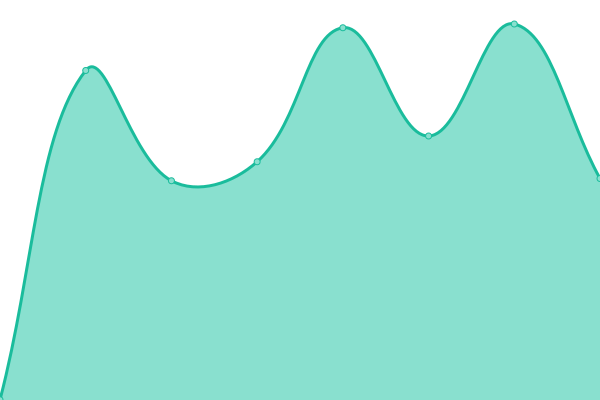
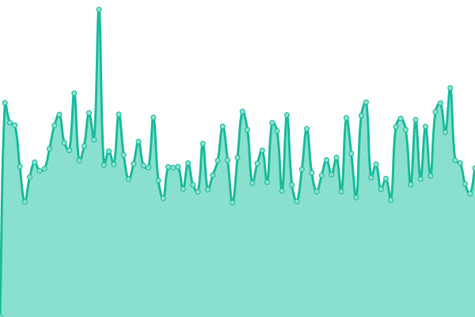
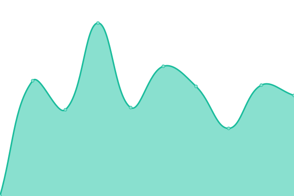

# [📈 Live Status](https://demo.upptime.js.org): <!--live status--> **🟧 Partial outage**

This repository contains the open-source uptime monitor and status page for [Wouter](https://demo.upptime.js.org), powered by [Upptime](https://github.com/upptime/upptime).

With [Upptime](https://upptime.js.org), you can get your own unlimited and free uptime monitor and status page, powered entirely by a GitHub repository. We use [Issues](https://github.com/Gerche/upptime/issues) as incident reports, [Actions](https://github.com/Gerche/upptime/actions) as uptime monitors, and [Pages](https://demo.upptime.js.org) for the status page.

<!--start: status pages-->
<!-- This summary is generated by Upptime (https://github.com/upptime/upptime) -->
<!-- Do not edit this manually, your changes will be overwritten -->
<!-- prettier-ignore -->
| URL | Status | History | Response Time | Uptime |
| --- | ------ | ------- | ------------- | ------ |
|  [Celta](https://celta.be) | 🟥 Down | [celta.yml](https://github.com/Gerche/upptime/commits/HEAD/history/celta.yml) | 

 848ms
     
 | 

<a href="https://Gerche.github.io/upptime/history/celta">94.32%</a>
    

|  [Sels](https://sels.be) | 🟩 Up | [sels.yml](https://github.com/Gerche/upptime/commits/HEAD/history/sels.yml) | 

 1405ms
     
 | 

<a href="https://Gerche.github.io/upptime/history/sels">100.00%</a>
    

|  [Flyinggroup](https://www.flyinggroup.aero) | 🟩 Up | [flyinggroup.yml](https://github.com/Gerche/upptime/commits/HEAD/history/flyinggroup.yml) | 

 4706ms
     
 | 

<a href="https://Gerche.github.io/upptime/history/flyinggroup">100.00%</a>
    

|  [Salkaperu](https://salkaperu.be) | 🟩 Up | [salkaperu.yml](https://github.com/Gerche/upptime/commits/HEAD/history/salkaperu.yml) | 

 3772ms
     
 | 

<a href="https://Gerche.github.io/upptime/history/salkaperu">100.00%</a>
    

|  [Vissaversa](https://vissaversa.com) | 🟥 Down | [vissaversa.yml](https://github.com/Gerche/upptime/commits/HEAD/history/vissaversa.yml) | 

 856ms
     
 | 

<a href="https://Gerche.github.io/upptime/history/vissaversa">94.53%</a>
    

|  [Momocollective](https://momocollective.be) | 🟩 Up | [momocollective.yml](https://github.com/Gerche/upptime/commits/HEAD/history/momocollective.yml) | 

 1632ms
     
 | 

<a href="https://Gerche.github.io/upptime/history/momocollective">100.00%</a>
    

|  [Boon](https://boon.be) | 🟩 Up | [boon.yml](https://github.com/Gerche/upptime/commits/HEAD/history/boon.yml) | 

 928ms
     
 | 

<a href="https://Gerche.github.io/upptime/history/boon">100.00%</a>
    

|  [Horal](https://horal.be) | 🟩 Up | [horal.yml](https://github.com/Gerche/upptime/commits/HEAD/history/horal.yml) | 

 2448ms
     
 | 

<a href="https://Gerche.github.io/upptime/history/horal">100.00%</a>
    

|  [Floordenil](https://floordenil.com) | 🟥 Down | [floordenil.yml](https://github.com/Gerche/upptime/commits/HEAD/history/floordenil.yml) | 

 853ms
     
 | 

<a href="https://Gerche.github.io/upptime/history/floordenil">94.89%</a>
    

<!--end: status pages-->

[**Visit our status website →**](https://demo.upptime.js.org)

## 📄 License

- Powered by: [Upptime](https://github.com/upptime/upptime)
- Code: [MIT](./LICENSE) © [Anand Chowdhary](https://anandchowdhary.com), supported by [Pabio](https://pabio.com)
- Data in the `./history` directory: [Open Database License](https://opendatacommons.org/licenses/odbl/1-0/)
